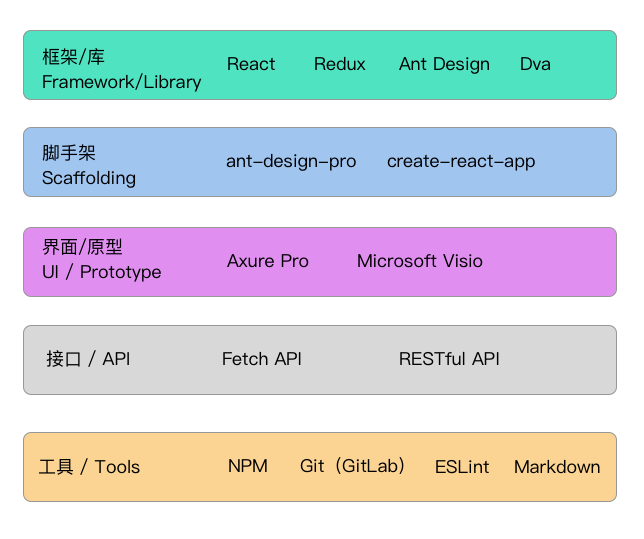

# 学习资料

## 视频教程

1. [2019 权威「HTML+CSS」零基础入门精英课【渡一教育】](https://ke.qq.com/course/231570?taid=2955805083273362)
2. [Web 前端开发之 JavaScript(Js)精英课堂【渡一教育】](https://ke.qq.com/course/231577?taid=2841395744442521)

## 书籍

1. JavaScript 高级程序设计（第 3 版)
2. JavaScript DOM 编程艺术（第 2 版）
3. JavaScript 语言精粹
4. 深入浅出 Node.js
5. JavaScript 框架设计（第 2 版)
6. JavaScript 权威指南（第 6 版）
7. JavaScript 忍者秘籍 第 2 版
8. ES6 标准入门（第 3 版） / [在线地址](http://es6.ruanyifeng.com/)
9. CSS 世界
10. 精通 CSS 高级 Web 标准解决方案 第 3 版
11. jQuery 基础教程（第 4 版）

## 综合

1. [Roadmap to becoming a web developer in 2019](https://github.com/kamranahmedse/developer-roadmap)
2. [Roadmap to becoming a React developer in 2019](https://github.com/adam-golab/react-developer-roadmap)
3. [JavaScript 教程 - 阮一峰 著](https://wangdoc.com/javascript/index.html)
4. [全栈工程师培训材料 - 阮一峰 著](https://github.com/ruanyf/jstraining)
5. [Study guide and introduction to the modern front end stack](https://github.com/grab/front-end-guide)
6. [Front End Interview Handbook](https://github.com/yangshun/front-end-interview-handbook)
7. [A set of best practices for JavaScript projects](https://github.com/elsewhencode/project-guidelines)
8. [Roadmap on becoming a UI/UX designer in 2017](https://github.com/togiberlin/ui-ux-designer-roadmap)
9. [State of JavaScript](https://2019.stateofjs.com/)

## 风格指南

- [Airbnb JavaScript Style Guide](https://github.com/airbnb/javascript)
- [Airbnb React/JSX Style Guide](https://github.com/airbnb/javascript/tree/master/react)

## 网站

1. [阮一峰的网络日志](http://www.ruanyifeng.com/blog/)
2. [FEX](https://fex.baidu.com/)
3. [酷壳](https://coolshell.cn/)
4. [Phodal Huang](https://www.phodal.com/)
5. [鑫空间，鑫生活](https://www.zhangxinxu.com/)
6. [Smashing Magzine](https://www.smashingmagazine.com/)
7. [Scotch.io](https://scotch.io/)
8. [Google Web Developers](https://developers.google.com/web/)
9. [Egghead](https://egghead.io/)
10. [FrontendMasters](https://frontendmasters.com/)
11. [JavaScript Weekly](https://javascriptweekly.com/)

## 🎨 前端技术栈

- 综合

  - 科学上网
  - MacBook (Air/Pro) / iMac
  - Google
  - English

- 通用工具

  - Linux
  - Shell
  - Git / GitHub / GitLab
  - Postman

- 测试工具

  - Jest
  - Enzyme
  - Cypress

- 开发工具

  - Webpack
  - ESLint
  - Prettier
  - Flow
  - Babel
  - NPM / NPM scripts
  - Travis CI
  - lodash
  - IndexedDB

- 语言

  - ECMAScript5 / ES6+
  - TypeScript

- CSS / CSS 预处理器 preprocessor

  - SASS
  - LESS
  - PostCSS

- 标准化

  - W3C
  - PWA / WebComponents / Polymer
  - Workbox

- 后端开发

  - Node.js
  - Express.js
  - MySQL
  - MongoDB
  - GraphQL
  - Apollo
  - Relay
  - Heroku
  - Serverless

- 计算机基础

  - 操作系统
  - 网络原理 TCP/IP HTTP 状态码
  - 设计模式
  - 数据结构及算法

- 设计

  - 平面设计
  - 网页设计
  - PhotoShop

## 其他

1. [Bing 每日一图 API](http://guolin.tech/api/bing_pic)
2. [My Brand New Logo](https://mybrandnewlogo.com/) 自动设计生成 LOGO
3. [MikuTools](https://tools.miku.ac/)
4. [图片压缩 Tinypng](https://tinypng.com/)
