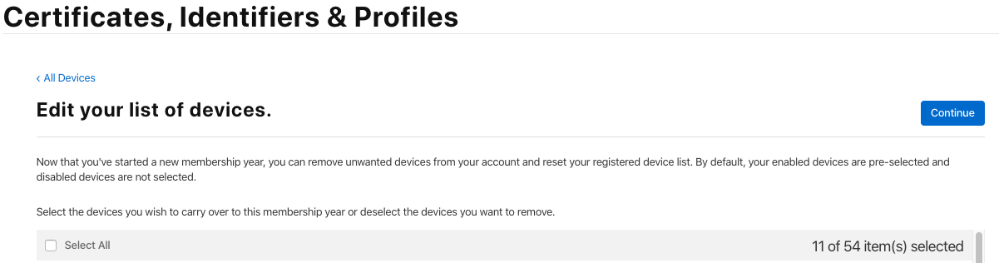

# React Native

## 学习资源

1. [React Native 官网](http://facebook.github.io/react-native/)
2. [慕课网 - 新版 React Native 从入门到实战打造高质量上线 App（再升级）](https://coding.imooc.com/learn/list/304.html)
3. [React Native 学习资源精选仓库](https://github.com/crazycodeboy/react-native-awesome)

## 开源项目

1. [Facebook F8 app of 2017](https://github.com/fbsamples/f8app)
2. [akveo/kittenTricks](https://github.com/akveo/kittenTricks)

## iOS linking libraries (连接原生库)

_RN < 60_  
第三方依赖库中含有原生代码，需要额外的操作，[文档](http://facebook.github.io/react-native/docs/linking-libraries-ios)

_RN > 60_  
通过 Cocoapods 安装

## Android Mulit-deployment（多版本部署）

[参考 react-native-code-push 配置文档](https://github.com/microsoft/react-native-code-push/blob/master/docs/multi-deployment-testing-android.md)  
APP 启动图标自动生成器: 1. [图标工厂](https://icon.wuruihong.com/) 2. [Android Asset Studio](https://romannurik.github.io/AndroidAssetStudio/)

## iOS Multi-Scheme（多版本部署）

[参考 react-native-code-push 配置文档](https://github.com/microsoft/react-native-code-push/blob/master/docs/multi-deployment-testing-ios.md)  
APP 启动图标自动生成器: [图标工厂](https://icon.wuruihong.com/)  
创建新的 Scheme, 在 Build Setting 中*Add a User Defined Setting*，添加自定义属性。每个 Scheme 应包括 bundle ID / App Icon / display name 和自定义属性。

## CodePush (热更新)

1. 插件：[react-native-code-push](https://github.com/microsoft/react-native-code-push)
2. Appcenter 命令行工具：[Management CLI](https://docs.microsoft.com/en-us/appcenter/distribution/codepush/cli)
3. 常用命令

- 推送更新

```
appcenter codepush release-react -a <ownerName>/<appName> -d <deploymentName> -t <targetBinaryVersion>
e.g.
appcenter codepush release-react -a jldjkj/riskcontrol-ios -d Staging -t 1.0.0 --description "date \n 1. fix bug \n 2. add new function"
appcenter codepush release-react -a jldjkj/riskcontrol-ios -d Staging -t "<=1.4.2" --description "date \n 1. fix bug \n 2. add new function"
```

- 查看详细更新历史

```
appcenter codepush deployment history [deploymentName] -a <ownerName>/<appName>
e.g.
appcenter codepush deployment history Staging -a jldjkj/riskcontrol-ios
```

- 不同环境间推送更新

```
appcenter codepush promote -a <ownerName>/<appName> -s <sourceDeploymentName> -d <destDeploymentName>
appcenter codepush promote -a jldjkj/riskcontrol-ios -s Staging -d Production
```

- 查看应用更新概况

```
appcenter codepush deployment list -a <ownerName>/<appName>
```

- 清理历史记录

```
appcenter codepush deployment clear -a <ownerName>/<appName> <deploymentName>
```

- 更新推送信息

```
appcenter codepush patch -a <ownerName>/<appName> <deploymentName> <existing-release-label>
e.g.
appcenter codepush patch -a jldjkj/riskcontrol-ios Staging v14 --description "date \n 1. fix bug \n 2. add new function"
label 参数命令行会报错，若忽略，默认是更新最后一个版本
```

## 消息推送

[极光开发者服务](https://www.jiguang.cn/) 创建应用，设置推送 Android / iOS  
极光推送插件 [jpush-react-native](https://github.com/jpush/jpush-react-native)  
每个应用单独设置，例如：debug/staging/release 三个版本

1. 极光推送证书有效期
2. [Android 杀掉进程后，收不到消息](https://community.jiguang.cn/t/app/28612)、[JPush 常见问题](https://community.jiguang.cn/t/topic/5145)
   Android 在国内是应用级别的推送，杀掉进程后，无法唤起，QQ、微信等是因为用户下意识的在手机里开启对他们的保护，
   他们是不少手机系统的自带软件，他们很难被杀死，即便杀死后也会以较快的速度重启
   极光推送支持「小米推送」、「华为推送」「魅族推送」「Google FCM」「OPPO 推送」等市场上已有的 5 种系统推送，
   在 App 杀死时，你通过极光推送发的消息，在这 4 种手机上，会自动走系统推送下发消息，需要开通 VIP。
3. iOS 是系统内（APN）推送，所以应用即使杀掉进程，也可以获取推送通知，并唤起应用

## 离线功能

插件：react-native-offline

## 第三方组件

RN 插件库： [React Native Example](https://reactnativeexample.com/)

## 打包

#### Android

方式一：`cd android && ./gradlew assembleRelease`  
方式二：连接真机, `react-native run-android --variant=release`

#### iOS

1. 启动 XCode
2. 选择 Release Scheme
3. 选择 General iOS Device
4. Menu -> Product -> Archive
5. 选择 App Store 或者 Ad Hoc

## 内部分发测试

1. 蒲公英
   iOS 设备需要通过蒲公英提供的二维码，扫码后获取 UDID，然后在 App Developer 中注册该设备，然后更新应用的 Provisioning Profile 中设备列表  
   每个版本单日下载量上限 100 次
   iOS 测试设备上限 100 台，设备即便禁用后，也计入其中。每一次年费到期续费，苹果允许重置一次；如果需要立即重置，也可以直接[发送邮件申请](https://developer.apple.com/contact/submit/)    
   Devices 会显示 Warning 信息 _Reset your device list before adding any new devices._
   
   选中在下一年要保留的设备  

2. TestFlight
   _尚未实践_

## App Store

证书类型： 个人 / 公司 年费 $99 / 企业 年费 $299
审核日期目前为 1 ～ 2 个工作日  
[查看订单](https://secure1.www.apple.com.cn/shop/order/list)

2020 年续费流程发生了改变，需要先在 iPhone 下载 Apple Developer App, 完成身份验证，然后才能续费

#### 企业开发者资质证书 certificate 更新

1. Mac 钥匙串访问 -> 证书助理 -> 从证书颁发机构请求证书 -> 创建 CSR
2. Apple Developer -> Certificate -> 创建 -> iOS Distribution (App Store and Ad Hoc) -> 选择 CSR -> 生成证书

#### 极光推送证书更新

1. Identifiers -> Push Noficications -> Edit -> Production SSL Certificate -> 选择 mac CSR
2. Certificates -> 创建 -> Apple Push Notification service SSL (Sandbox & Production) -> App ID -> 生成 Cer 文件
3. 双击 Cer 文件 -> 右键导出 p12 文件 -> 设置密码 -> mac 登录密码
4. 极光后台 -> app -> iOS -> 证书配置 -> 编辑 -> 选择上传 p12 文件，输入证书密码
5. （将要）过期的 Certificate 可以删除

#### 蒲公英内测版证书更新

1. Profiles -> Edit -> 选择新的企业证书 -> 保存导出 provision 文件 -> Xcode Organizer -> 打包更新

## Android 应用市场

1. 腾讯开放平台（应用宝）
2. 阿里应用分发开放平台（PP 助手 / 豌豆荚 / UC 应用商店）

企业注册需要提交营业执照，应用上架需要提交软件著作权

## React Naitve 版本升级

_尚未实践_ [文档](http://facebook.github.io/react-native/docs/upgrading)

## 启动模拟器

1. Android Studio -> Run / iOS Xcode -> Run
2. iOS 指定模拟器, [React Native Change Default iOS Simulator Device](https://stackoverflow.com/questions/37328942/react-native-change-default-ios-simulator-device)  
   `react-native run-ios --simulator="iPhone X"`  
   查看 Xcode 可用模拟器 `xcrun simctl list devices`  
   直接开启 `open -a simuloar`
3. [命令行启动 Android 模拟器](https://developer.android.com/studio/run/emulator-commandline)

```
emulator -list-avds // Nexus_5X_API_28
emulator -avd Nexus_5X_API_28
```

## 版本更新

RN 60.0 + 增加了快速启动脚本

```
npm run ios
npm run android
```

同时默认支持 pod

ios/Podfile.lock 默认为在 git 版本管理中，团队中 cocoapods 可能会不同 pod install 会改变该文件  
统一 cocoapods 方法：

```
sudo gem list cocoapods 查看当前版本信息
sudo gem uninstall cocoapods 删除
sudo gem install cocoapods -v [version] 安装指定版本
```

## 开发问题

1. ERROR: [Builds in Xcode but not using command line](https://github.com/facebook/react-native/issues/18793)  
   解决方法：删除 ios/build 文件夹，重新运行

## 投影

- Total Control（Android on Windows）
- 隔空投放
