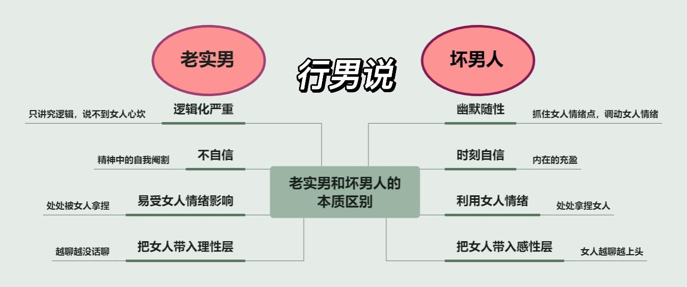

## 情商

- 情商高不是喜怒不形于色，而是通过对他人情绪的感知，对自己情绪的控制，给别人想要的回应，学会运用情绪，通过恰到好处的行为，达到自己的目的，所谓价值最大化。

## 恋爱

- [为什么说，追女孩，不要急着表白](https://zhuanlan.zhihu.com/p/97319338)
- [89%男生不懂！專家曝「4 潛規則」做錯＝緣份盡了...剛交往別熱太快](https://health.ettoday.net/news/1737637)
- [恋爱的过程，如何从普通朋友到情侣关系呢](https://www.zhihu.com/question/25316274)
- [为什么有些情侣谈着就感情越来越淡有些却越来越深？](https://www.zhihu.com/question/27713207)
  1. 所谓的新鲜感，不是一次次和新人体验旧的生活，而是和旧人一次次去尝试新的生活。
  2. “爱情”这件事儿，的确很重要。但放在每个人的生活里，不过是组成生活的一小部分
  3. 当你把一件事情看得过于重要，自然期望也就越高，一旦没达到彼此的预期，就会换来成倍的失望，这是一件非常可怕的存在。
  4. 就是因为有些人看似谈了很多年，但回忆起来的种种经历，好像就只有约会、吃饭、看电影，重复着过着相同的生活。  
     而有些人回顾过往，两个人从稚嫩变得成熟、从一无所有到丰富多彩，每个人都因为这段感情的存在而变成了一个更好的自己，这段感情对于彼此来说，是唯一的、无法被取代的。
- [你要是这么沟通，我劝你还是别谈恋爱了](http://eladies.sina.com.cn/feel/xinli/2017-11-23/0713/doc-ifynwhww5935854.shtml)
- [如何在恋爱关系中更好地沟通](https://zh.wikihow.com/在恋爱关系中更好地沟通)
- [你们觉得情侣间需要天天聊天吗](https://www.zhihu.com/question/358334962)
  1. 留住一个人最好的方式，永远不是黏着对方，每天都患得患失、敏感焦虑，而是你能够经营好自己的生活，当你变得强大且有安全感了，伴侣自然就会离不开你。
  2. 当一个人深信“跟你在一起有未来、有期待、有价值”的时候，这反而最能拴住一个人的心。
  3. 要明白：爱情这件事儿，的确很重要。但放在每个人的生活里，你慢慢就会发现“爱情其实只能占据生活中的一小部分”。
  4. 聊天并不是生活的必需品，陪伴才是。
- [有哪些事是谈过多次恋爱才明白的?](https://www.zhihu.com/question/55783301/answer/1760608018)
- [到底什么才是谈恋爱?](https://www.zhihu.com/question/383928922/answer/1747940553)
- [什么样子的情侣关系能够长久?](https://www.zhihu.com/question/435769097/answer/1662746156)
- [女朋友说想独处一段时间，怎么办？](https://www.zhihu.com/question/375759947)
- [健康与不健康的恋爱关系](https://www.ualberta.ca/media-library/ualberta/students/university-wellness-services/ccs/handouts/simplified/healthy-vs-unhealthy-relationships-sc.pdf)
- [怎么谈恋爱才能长久谈下去呢？](https://www.zhihu.com/question/30616492)
- [女生不秒回你微信，她在想些什么](https://new.qq.com/rain/a/20190706A07K9000?pc)
- [如何理解女生晚回，甚至是偶尔不回消息的行为，以及该如何应对？](https://www.bilibili.com/read/cv19234713)
  1. 女生是一种很讲感觉、很讲心甘情愿的动物，女生她不愿意、她不想要对你那样，你要求她也是要求不了的
  2. 人，尤其是女人，她是根据自己的感受、感觉来回应你的
  3. 如果你的某个行为让对方的感觉不好，那么对方往往就会对于你的这个行为，回应的不好
  4. 你不能拿自己的习惯、观念，去要求别人一定要和你一样
- [怎么确定你的女朋友（男朋友）是适合的结婚对象？](https://www.zhihu.com/question/21778422)
  1. 本质的善良，天性的温厚，开阔的胸襟 ——《傅雷家书》
- [恋爱的过程，如何从普通朋友到情侣关系呢](https://www.zhihu.com/question/25316274)
  1. 和我一起过有意思且精彩的生活吧
  2. 你要向女生展示，你的世界很精彩，至少，你愿意为了她，让你们的世界变得精彩。
- [如何确定女生是在考察自己还是根本就不喜欢自己](https://www.zhihu.com/question/26597211)

## 相亲

- [总结 30 条实战的相亲经验](https://zhuanlan.zhihu.com/p/348371236)
- [女生不冷不热，该继续追吗？](https://wukong.toutiao.com/question/6420591133583212802/)
- [从男性角度角度给正在相亲的女孩子一点忠告](https://www.douban.com/group/topic/52135387/)
- [32 岁的女性在相亲过程中各种被同龄人嫌弃年龄，想娶年轻漂亮老婆的 80 后男士最终会如愿吗？](https://www.zhihu.com/question/284720918)
- 大龄女 追不动，暖不热，一直在希望和失望之间徘徊
- [遇到不拒绝不主动的相亲女，怎么办？](https://www.zhihu.com/question/65176100/answer/417079327)  
  所谓表白，并不需要十足的把握，表白不光是冲锋的号角，也可以是撤退的号角，给双方一个完整的交代。
- 相亲对象如果是医生
  - 如果你英文很好，又玩得来数据库，就帮她检索检索文献、做做 ppt 之类，那真的是再贴心不过了
  - 平时微信多热乎聊，不用在意女医生几个小时甚至一天后才回，能回就不错了好吗！对方超忙啊！！
  - 不要每次见面都很隆重，比如去他们医院看看她（休息室坐坐啊，带点吃的给她啊），再忙的话 2 分钟会面的时间还是有滴，女孩子可喜欢细心的男孩纸啦！
- [都相亲了 还想要慢慢认识 等到互相熟悉了有好感了 再成为男女朋友?](https://www.zhihu.com/question/436933247)
- 不高攀不低就的婚姻才能长久
- 虽然对方可能不真诚（被父母逼、骑驴找马、有心上人），但是自己要做到真诚，自己只要做到识别不真诚的人然后排除 TA 就可以。
- [有哪些你从相亲中悟出的道理？](https://www.zhihu.com/question/297618574)
  - 不要跪舔。要与对方人格平等，对方颜值和条件再高，你也不要跪舔，你要理智的像一个旁观者，要把灵魂抽出来站在旁边看你俩相亲，然后再来分析适不适合你。
  - 相亲说白了 就是以貌取人
  - 任何时候都要保持大度和宽容，万不可恶语相向
- [大龄剩男如何找对象？](https://www.zhihu.com/question/302684598)
- [大家通过相亲都明白了什么道理、得了什么感悟？](https://zhuanlan.zhihu.com/p/347382316)

## 如何说话

- 表达情绪时 陈述 + 示弱 > 反问
- 夸别人时，夸细节 > 笼统夸
- 用回夸的方式，巧妙延续话题
- 给对方发言空间，避免自嗨
- 不正面与别人的恶言恶语交锋 （即使感到对方明显的恶意，也不正面回应）
- 语言受限时，可以用行动替代

> [来源-黛西巫巫](https://www.zhihu.com/people/dxww)

## 变坏

- 老实男人更讲究逻辑化，很在乎自己的前言后语是否合乎逻辑；而坏男人的聊天看似无厘头，但总是能够找准女人的情绪点
- 老实男人总把自己摆在被审视的位置，担心自己的举动不够有魅力；而坏男人心态永远自信，敢于筛选女人
- 老实男人看到女人来情绪了，都会慌的手忙脚乱，生怕自己做错了。而坏男人会利用女人的情绪，完成一次次关系的升级、驯化
- 老实男人总是和女生停留在字面意义上的沟通，导致女人越聊越理智，没有嗨点；而坏男人秉持“万物皆可升级”的思想，不断深入聊天的尺度。

## 见家长

- [男生/女生第一次见家长攻略](https://zhuanlan.zhihu.com/p/60971387)

## 为人处事

**说话的艺术** **幽默**

- 逢人且说三分话，未可全抛一片心

就算心里是那么想的，也不能那么说，即说话不能太直

- 工作中 严于律己 宽以待人，说话不要带刺儿、冷嘲热讽，每个人追求不一样，言语相激会让双方都不舒服，于事无补
- 你叫不醒装睡的人，还是把时间放在提升自己身上

## 相亲经历总结

**2021.5~2021.10**

类型：追不动暖不热

过程：不讨厌不喜欢不主动不拒绝，主动去追，坚持数月，最后被人家嫌弃了

总结：初次交往，经验不足

**2021.11~2021.12**

类型：物质享受，自信自恋

过程：一开始就觉得不合适，往下走也是为了多长点交往经验，最后被找出几个理由分开，当“备胎”了

总结：不合适的人 不能当回事 也是经验不足 学习了

**2022.7~2022.10**

类型：物质享受，表里不一，见人说人话见鬼说鬼话

过程：消费观差异大，花钱大手大脚，“女儿富养”，前两周就觉得三观不合，争执后选择放弃，最后被人家哄回来。可是根本问题是无法解决的，嘴里一套，心里一套，“搂腰”说“痒”，回信极慢，一而再再而三，见面极难，各种理由敷衍，吃饭很快着急回家，最后以“爱掉脸子 不惯着”的理由分开，其实是没法拖下去了，被当“备胎”了。

总结：这类在比较乱的圈子（有钱有势）里的人，说话分不清真假，尽早远离

**2023.2**

类型：高冷 生活精致 心思缜密

过程：这类女生长相身材气质确实令人喜欢，但是不能因此而“跪舔”，用不着天天发信息，你越是献殷勤，她越不在意，反而觉得你在迎合她、讨好她；需要的是价值吸引，而不是平淡的嘘寒问暖，提供高价值情绪，把精力重心放在自己身上，花钱往自己身上花，适当保持距离。若对方不合适，也绝不要苦苦挽留

总结：经济水平差距较大，无法满足对方生活水平要求，如果靠自身能力吸引不了就算了

**2023.6~2023.7**

- 她问我不开心怎么办 我答 去江边走走，跟朋友聊聊天，还有就是写下文字，发泄心中的愤懑和抑郁
- 她问我给她打多少分，我说 80 分，我问她给我打多少分，她说 60 分，或许感到不妥，马上改成 70 分；同时还具体的说明了符合她标准的几点有 年龄、身高、学历，言下之意其他诸如 家境、经济、工作、长相、性格、人品等未达到择偶要求。一个在她的评分表中刚及格的人怎么能够吸引她、令她动心呢？
- 她和家里人对家境、房贷、工作性质了解越来越细，我能接收，只是她表达的方式和时间节点让我心里不大舒服
- 互加微信的 45 天， 见面约 10 次，交流沟通的质量并不差，却不能牵手升级关系，每次询问进度和感觉，给不出回复，常用的话语“再熟悉熟悉了解了解”
- 5 天未见，见面敷衍情绪不高，因为自己有烦心事，不愿同我分享诉说，我现在的身份还没有倾听的资格；谈话冷淡，和期待产生很大反差，心中很是沮丧，不觉在想“这是在处对象吗？” 我没有安慰人、转移情绪的能力，这种情况下该多聊聊自己的事，避重就轻，然后尽快结束此次约见，改天见面更好
- 处对象时，被偏爱的一方往往更有心里优势，我在她眼中可能属于“食之无味弃之可惜”的角色吧
- 某一瞬间，突然感觉相处太累了，看不到希望。有信息必回、有约必应、交往期间有说有笑，这些是维持我走下去的动力；然而我看不到希望，一直是我在前进她在原地、甚至往后退的相处态度，难以接受。热情如果得不到滋养，就会慢慢的耗散。即便存在男女思维差异，相识相知相恋相爱也是有一定规律可循的
- 微信中的笑脸表情与现实中的理智与冷淡形成反差；如果没有确定关系，不要轻易相信微信里的甜言蜜语或是表情，自我带入、一厢情愿，可能会受挫
- 我不是为了占她便宜才去挽她胳膊的，而是为了增进感情才尝试肢体接触的；然而当她婉拒后，以及不明朗的态度，我目前已没有牵手的欲望
- 看电影时，我看向她的侧脸，她微微一笑，并没有眼神上的回应。我觉得她的注意力基本都在电影上，不在意看电影之于处对象的意义。我尝试把爆米花喂到她口中，她下意识的用手接过，浪漫的小心思化为乌有；我不死心，尝试第二次，同样未果。
- 如果她对你有好感，当天有事约不成，也许会主动提出再约吧
- 如果她对你有好感，几天不见也许是期待见面的、内心会是欣喜的吧
- 如果她对你有好感，无论是晚上聊天、还是散步，是不会太在意时间或严格的限定时间吧
- 有些事情需要三番五次的确认吗？不需要！我都已经经历过了，人家若没看上你，就不要自欺欺人；死皮赖脸、纠缠不休、跪舔是男人掉价儿的行为，只不过是在感动自己罢了
- 女人，你也越对她好、用心、真诚，越被当作廉价品，不知珍惜；你放得下、不去理她，她反而觉得你有魅力
- 交往中，双方是种平等关系，不是越用力越认真越投入越好，没有确定关系前，不要想当然代入恋人身份，即便相亲是以结婚目的，也不能强人所难
- 那么接下来我该怎么做呢？答案就是让自己舒服开心，放得下看得开，转移注意力；不再较真、刨根问底、抓着一个问题死缠烂打，她不说就表达了态度，很多不痛不痒的事情，过去了就都翻篇了，拒绝直男癌！不要把她当作女朋友对待，更不要当作非她不娶的未来伴侣对待；就当刚认识的朋友、一起聊聊天吃吃饭玩一玩就好，舒服自然的状态对谁都好
- 不要用反问句、不要情绪过激、不要冷嘲热讽、不要语速过快、不要表情凝重，切记切记！
- 不主动不拒绝不喜欢不讨厌，没有达到人家的标准，这就是常态，不要太在意了，犯不上较真
- 衡量、取舍、博弈终究是这个社会相亲市场的产物，接受现实，面对现实，平常心，不要着急
- 不要把心思都放在谈情说爱上，被人家一个表情一句话搞得浮想联翩、心神不宁，这很容易导致整天情绪波动、精神内耗、心情压抑，越是在意越是失望；谈恋爱只是生活中的一个组成部分，并非全部，拎得清放得下，该干嘛干嘛去；遇到合适的人，是不会有这么累的感觉的

**2023.8**

- 是否要把过去自己的难受沮丧经历向对方说出来呢，答案是千万不要！！！今天也不知道为什么把之前不愉快的经历倒腾出来，感觉太差了。过去的事就翻篇了，你抓住它，对对方、对自己一点好处都没有！
- 把精力放在提升自己身上，身心健康更为重要
- 微信的对话千万不要太当真，关系还不到，别自我感动
- 不要去要求对方怎样，喜欢你的自然不在意各种外在原因（天气、工作、作息、朋友聚会、娱乐），原因就是还没有达到足够喜欢的程度
- 情绪再激动，不要用反问句，不要冷嘲热讽，不要语速过快，不要抬高说话声音，不要脸色阴沉，切记切记！
- 不要再问“这段时间相处下来感觉怎么样，有哪些需要改进的地方了”，不适用，没意思
- 不要抓着对方情绪不高不放，要么自己主动找些话题，要么和颜悦色快速散场，下次再来
- 不要因为一次牵手不成功，就闷闷不乐，大的方向没有问题，就继续往前走。多创造机会，多用点心，多点耐心，氛围到了，自然水到渠成
- 女生，其实就是哄一哄、夸一夸、疼一疼、宠一宠
- 不要在意女生不够主动，或者发信息有人为时间限制，或者回信息字数谁长谁短，或者约会时情绪不高，不要在意这些边边角角，把精力用在提高自己身上
- 惹女孩子不开心，就是男生的错，不接受任何反驳；主动认个错、道个歉，别太执拗了，娶到家了才是真本事。当然前提一定是合得来，打心里喜欢人家，否则即便成了，婚姻也一定是不幸的
