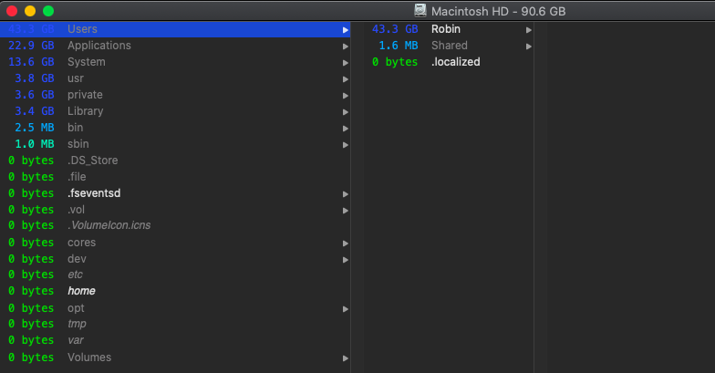

# MacBook / iPhone

## MacBook 常用软件

| 软件            | 功能               |
| --------------- | ------------------ |
| MagicanRest     | 休息提醒           |
| VirtualBox      | 免费的虚拟机       |
| Folx            | 下载工具           |
| Charles         | 抓包工具           |
| Dr.Cleaner      | 系统清理工具       |
| SmartSVN        | 管理工具           |
| Alfred          | 快速搜索工具       |
| ForkLift        | FTP                |
| Fliqlo          | 经典时钟屏保       |
| iTerm           | 终端               |
| Oh My Zsh       | 终端               |
| Homebrew        | 包安装工具         |
| OminDiskSweeper | 文件分布查看       |
| HandShaker      | Android 文件传输｜ |

## macOS 查看本地 IP

```
$ ipconfig getifaddr en0
或者
$ ifconfig | grep inet
```

## Mac 屏幕共享

系统偏好设置 -> 共享 -> 屏幕共享  
共享电脑安装 `VNC Viewer`， 直接输入共享 Mac ip 地址，输入 IP（账户/密码）

## Mac 快捷键

| 操作               | 快捷键                 |
| ------------------ | ---------------------- |
| 聚焦搜索 Spotlight | Command + Space        |
| 显示/隐藏 文件     | Command + Shift + .    |
| 强制推出任务       | Option + Command + Esc |

## Mac 看根目录文件大小分布

```
$ du -sh *
```

查看 Library 下文件分布

```
$ cd Library
$ du -d 1 -h
```

查看硬盘空间

```
$ df -h
```

升级系统/XCode 会占用大量内存，储存空间中“其他”占用很大空间


使用[OmniDiskSweeper](https://www.omnigroup.com/more/)，文件从大到小显示



## 查看 iOS simulator 列表

```
$ xcrun simctl list devices
```

`Error：Unable to boot device because it cannot be located on disk`, 解决办法：

```
$ xcrun simctl erase all
```

## iPhone 投影到 MacBook

1. iPhone 数据线连接 MacBook
2. MacBook 开启 QuickTime player, 目录 -> 文件 -> 新建影片录制
3. 按录制旁边的选项，选择连接的 iPhone

## Mac 创建 txt file

Spotlight -> TextEdit.app -> Menu -> 文本编辑 -> 偏好设置 -> 新建文稿 -> 纯文本

## SmartSVN

SmartSVN 修改 repository 地址：Menu -> Modify -> Relocate

## Axure RP

macOS 升级 10.15，Axure RP 8 打不开，需要下载 8.1.0.3388 或 9， 下载地址：[Axure RP 8 Mac](https://www.axure.com/release-history/rp8)  
注册码：  
Licensee：zdfans.com  
Key：gP5uuK2gH + iIVO3YFZwoKyxAdHpXRGNnZWN8Obntqv7 ++ FF3pAz7dTu8B61ySxli

## 其他

1. App Store 下载慢，尝试将 DNS 配置为 `114.114.114.114`
2. [MacWk](https://macwk.com/) Mac 软件下载
