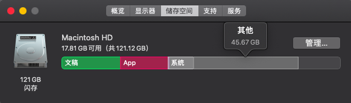

# Mac

## Mac 常用软件

| 软件                                                              | 功能             |
| ----------------------------------------------------------------- | ---------------- |
| MagicanRest                                                       | 休息提醒         |
| VirtualBox                                                        | 免费的虚拟机     |
| Folx                                                              | 下载工具         |
| Charles                                                           | 抓包工具         |
| Dr.Cleaner                                                        | 系统清理工具     |
| ~~SmartSVN~~ ~~Cornerstone~~ Xversion                             | 版本管理工具     |
| Alfred                                                            | 快速搜索工具     |
| ForkLift                                                          | FTP              |
| Fliqlo                                                            | 经典时钟屏保     |
| iTerm                                                             | 终端             |
| Oh My Zsh                                                         | 终端             |
| Homebrew                                                          | 包安装工具       |
| OminDiskSweeper                                                   | 文件分布查看     |
| HandShaker                                                        | Android 文件传输 |
| [PDMan](http://www.pdman.cn/)                                     | 数据库建模工具   |
| [VNC Viewer](https://www.realvnc.com/en/connect/download/viewer/) | 屏幕共享         |

> ~~[MacWk](https://macwk.com/)（已关站）~~ Mac 软件下载其他选择

- [macyy](https://www.macyy.cn/)
- [macapp](https://macapp.org.cn/)

## Homebrew

下载很慢 填加 DNS `8.8.8.8`  
下载报错 `fatal: unable to access 'https://github.com/Homebrew/brew/': Failed to connect to github.com port 443: Operation timed out`

> 正确的做法应该是 关闭 VPN

网络问题 多试几次 或者尝试  
raw.githubusercontent.com 查找 IP 编辑 hosts 文件 或者尝试

```
git config --global --unset http.proxy
git config --global --unset https.proxy
```

## macOS 查看本地 IP

```
ipconfig getifaddr en0
或者
ifconfig | grep inet
```

## Mac 屏幕共享

系统偏好设置 -> 共享 -> 屏幕共享  
共享电脑安装 `VNC Viewer`， 直接输入共享 Mac ip 地址，输入 IP（账户/密码）

## Mac 快捷键

| 操作               | 快捷键                 |
| ------------------ | ---------------------- |
| 聚焦搜索 Spotlight | Command + Space        |
| 显示/隐藏 文件     | Command + Shift + .    |
| 强制推出任务       | Option + Command + Esc |

## Mac 看根目录文件大小分布

```
du -sh *
```

查看 Library 下文件分布

```
cd Library
du -d 1 -h
```

查看硬盘空间

```
df -h
```

升级系统/XCode 会占用大量内存，储存空间中“其他”占用很大空间



使用[OmniDiskSweeper](https://www.omnigroup.com/more/)，文件从大到小显示


## 查看 iOS simulator 列表

```
xcrun simctl list devices
```

删除无效的 device

```
sudo xcrun simctl delete unavailable
xcrun simctl delete [device_UUID]
```

`Error：Unable to boot device because it cannot be located on disk`, 解决办法：

```
xcrun simctl erase all
```

## iPhone 投影到 MacBook

1. iPhone 数据线连接 MacBook
2. MacBook 开启 QuickTime player, 目录 -> 文件 -> 新建影片录制
3. 按录制旁边的选项，选择连接的 iPhone

## Mac 创建 txt file

Spotlight -> TextEdit.app -> Menu -> 文本编辑 -> 偏好设置 -> 新建文稿 -> 纯文本

## SmartSVN

SmartSVN 修改 repository 地址：Menu -> Modify -> Relocate

## Axure RP

macOS 升级 10.15，Axure RP 8 打不开，需要下载 8.1.0.3388 或 9， 下载地址：[Axure RP 8 Mac](https://www.axure.com/release-history/rp8)  
注册码：  
Licensee：zdfans.com  
Key：gP5uuK2gH + iIVO3YFZwoKyxAdHpXRGNnZWN8Obntqv7 ++ FF3pAz7dTu8B61ySxli

## 端口号占用情况

```
#命令格式：lsof -i :端口
lsof -i:8080

#杀掉进程
kill -9 pid
```

## 其他

1. App Store 下载慢，尝试将 DNS 配置为 `114.114.114.114`
2. Mac 输入特殊字符 ⌘ + ⌃ + Space

## 系统

1. 硬件诊断

关机状态下，长按 D 键，直到出现旋转的地球，连接网络，然后点击同意诊断，几分钟后会出具报告

2. 重做系统（最新）

开机后，按住 Command + R， 直至出现连设置网络的选项

3. 恢复出厂系统

开机后，按住 Command + Option + Shift + R， 直至出现连设置网络的选项
